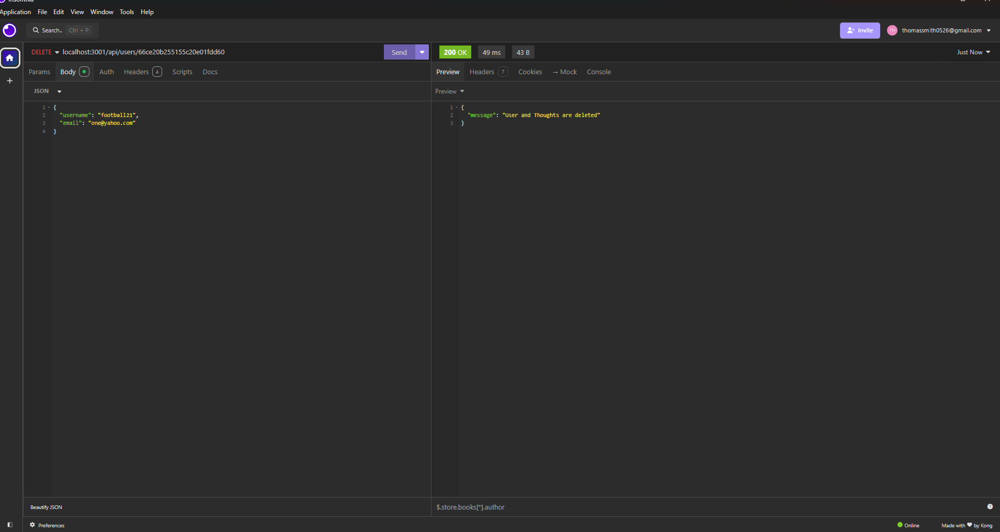
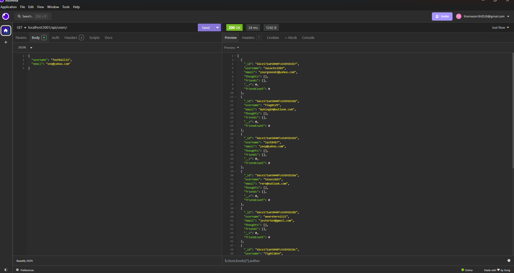
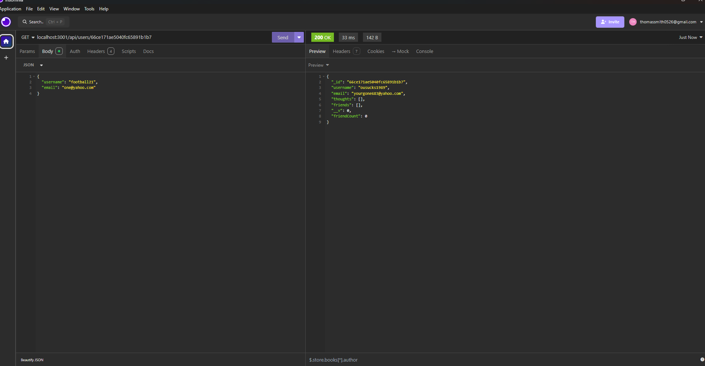
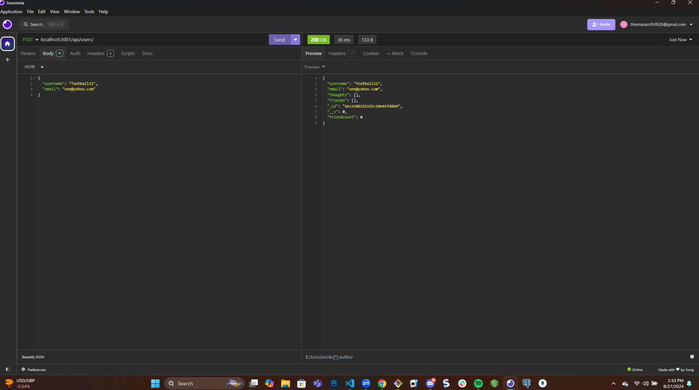

# Social-API
## Git Hub
thomassmith0526
## Table of Contents 
* [Email](#Email)
* [Description](#Description)
* [License](#License)
* [Screen-Shots](#Screen-Shots)
## Email
thomassmith0526@gamil.com
## Description 
By using mongooseDB i was able to write routes for the user and thoughts. You are able to get all the users, get them by id, update them, post new users, and delete users too.
## License
MIT
## Screen Shots 

## Questions
If you have any questions please fill free to email me at thomassmith0526@gmail.com